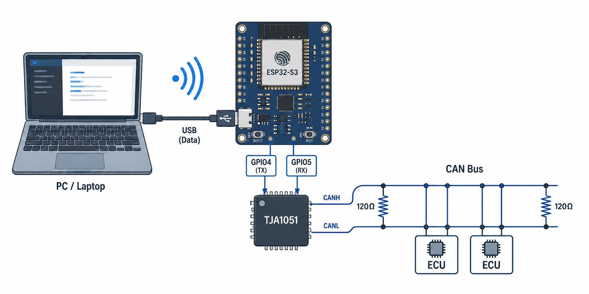
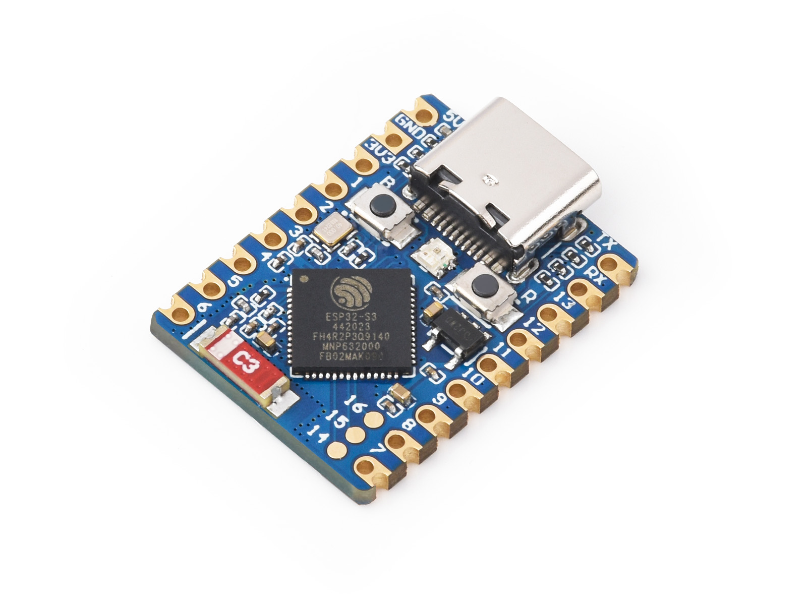
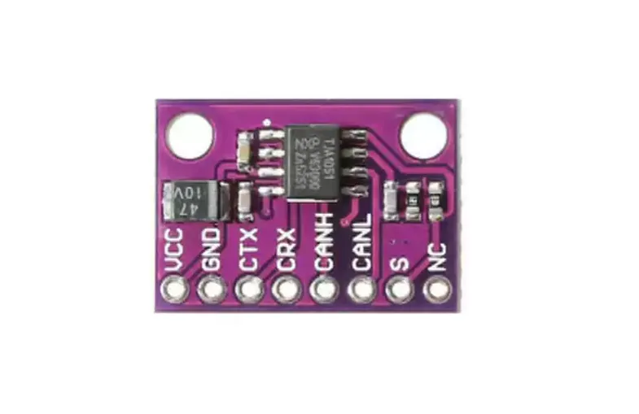

# open-can-link

基于 **ESP32-S3 / CH32V203** 的 USB-CAN 2.0 调试工具，外接 TJA1051T CAN 收发器。

双硬件方案，共用同一套 JSON 协议和 PC 上位机。开放、可编程、低成本，替代封闭的厂商 USB-CAN 模块。



---

## 硬件

项目提供两套硬件方案，根据成本和功能需求选择。

### 方案 A：ESP32-S3-Zero（主力方案）

| 模块 | 型号 | 购买 |
|------|------|------|
| 主控 | [ESP32-S3-Zero](https://www.waveshare.net/shop/ESP32-S3-Zero.htm)（板载 WS2812） | 微雪 |
| CAN 模块 | TJA1051T | [淘宝](https://item.taobao.com/item.htm?id=624503860089) |

<table><tr>
<td></td>
<td></td>
</tr></table>

**引脚连接：**

```
ESP32-S3 CAN_TX (GPIO4)  →  CAN 模块 TXD
ESP32-S3 CAN_RX (GPIO5)  ←  CAN 模块 RXD
ESP32-S3 GPIO6           →  CAN 模块 S   (LOW=正常, HIGH=静音)
ESP32-S3 GPIO21          →  WS2812 LED   (状态指示)
USB OTG (GPIO20/19)      →  USB-C 数据线  (CDC 虚拟串口)
```

### 方案 B：CH32V203C8T6（低成本方案）

成本更低的替代方案，适合大批量部署或成本敏感场景。

| 模块 | 型号 |
|------|------|
| 主控 | CH32V203C8T6 (RISC-V, 144MHz, 64KB Flash / 20KB RAM) |
| CAN 模块 | TJA1051T |
| 开发环境 | MounRiver Studio Ⅱ |

**引脚连接：**

```
CH32V203 CAN_TX (PB9)    →  CAN 模块 TXD
CH32V203 CAN_RX (PB8)    ←  CAN 模块 RXD
CH32V203 CAN_S  (PB15)   →  CAN 模块 S   (LOW=正常, HIGH=静音)
CH32V203 USB_D- (PA11)   →  USB 数据线
CH32V203 USB_D+ (PA12)   →  USB 数据线
CH32V203 UART_TX (PA9)   →  USB-UART 桥接（调试输出）
CH32V203 UART_RX (PA10)  ←  USB-UART 桥接（调试输出）
CH32V203 WS2812  (PA7)   →  WS2812 LED   (状态指示)
```

CAN 2.0A / 2.0B，11/29-bit ID，0~8 字节数据，波特率 125k/250k/500k/1M。不支持 CAN FD。

---

## 工作模式

- **USB-CAN 有线模式**：USB CDC 虚拟串口，适合自动化测试和脚本控制（两套硬件通用）

---

## 快速开始

```bash
# ESP32 固件
cd software/esp32/can_bridge
get_idf60 && idf.py set-target esp32s3 && idf.py build && idf.py -p <PORT> flash

# PC 上位机（两套硬件通用）
cd software/pc && uv sync && uv run python main.py
```

连接设备后，在 CAN 收发标签页点击「CAN Start」即可开始收发。

---

## 通信协议

USB CDC 共用同一套 JSON 命令协议。用任何串口终端都能直接和设备交互：

```bash
echo '{"cmd":"can_start"}' > /dev/ttyACM0
echo '{"cmd":"send","id":0x123,"ext":false,"data":[1,2,3]}' > /dev/ttyACM0
```

完整协议见 [docs/protocol.md](docs/protocol.md)。选择 JSON 而非二进制协议的设计考量也记录在该文件中。

---

## 项目结构

```
open-can-link/
├── docs/                     # 文档
├── software/
│   ├── esp32/                # ESP32-S3 固件（方案 A）
│   │   ├── can_bridge/       # 综合桥接程序
│   │   ├── components/       # 共享组件 (can_driver / usb_cdc / protocol)
│   │   ├── test/             # 硬件模块测试
│   │   └── ref/              # 参考代码
│   ├── ch32/                 # CH32V203 固件（方案 B）
│   │   └── ref/              # 参考代码
│   └── pc/                   # PC 上位机（两套硬件通用）
├── hardware/                 # 硬件设计
├── README.md
└── CLAUDE.md
```

---

## 文档

| 文档 | 说明 |
|------|------|
| [docs/protocol.md](docs/protocol.md) | JSON 通信协议 |
| [docs/firmware.md](docs/firmware.md) | 固件开发指南 |
| [docs/getting_started.md](docs/getting_started.md) | 详细上手教程 |
| [docs/pc_upper_computer.md](docs/pc_upper_computer.md) | PC 上位机说明 |

---

## 未来计划

- **Wi-Fi 无线模式**（ESP32-S3 方案 A 专属）：设备自建热点，网页调试
- **网关模式**（ESP32-S3 方案 A 专属）：接入现有网络，提供 TCP / WebSocket 接口
- **CH32V203 固件开发**：完整实现 USB-CDC ↔ CAN 桥接，与 PC 上位机对接

---

## License

MIT License
